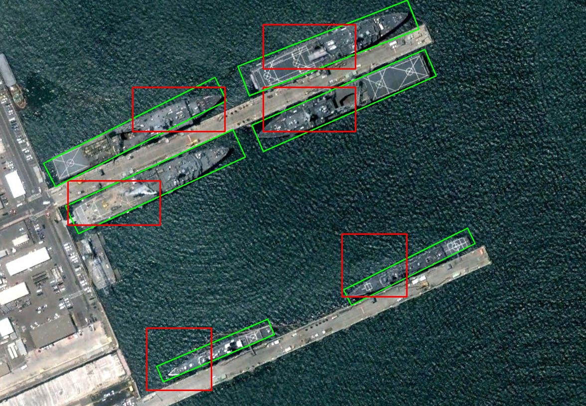

# Rotated-Retinaned fork for Google Colab

This is a fork of the Rotated-RetinaNet implemetation for Google Colab usage. This code was changed to primary support the DOTAv1.5 dataset and a newer Python version.

### The script was tested on:
* Python 3.11.12
* torch 2.6.0+cu124
* cuda_12.5.r12.5/compiler.34385749_0
* gcc (Ubuntu 11.4.0-1ubuntu1~22.04) 11.4.0

## Rotation RetinaNet

The codes build R-RetinaNet for arbitrary-oriented object detection. It supports the following datasets: DOTA, HRSC2016, ICDAR2013, ICDAR2015, UCAS-AOD, NWPU VHR-10, VOC2007. 

## Getting started

Follow the `demo.ipynb` or follow the next steps one by one.

### Installation
Build the Cython and CUDA modules:
```bash
cd $ROOT/utils
sh make.sh
```

Install Dota-devkit:
```bash
sudo apt-get install swig
swig -c++ -python polyiou.i
python setup.py build_ext --inplace
```

### Inference
```bash
python demo.py --weight None
```

### Train
1. Prepare dataset and move it into the `$ROOT` directory. First, make sure your initial data are in the following structure.
```
$ROOT/DOTA
├── train
│   ├──images
│   └── labelTxt
├── val
│   ├── images
│   └── labelTxt
└── test
    └── images
```

Then split the dataset with:
```
cd $ROOT/datasets/DOTA_devkit

python ImgSplit_multi_process.py \
    --raw_root_dir $ROOT/DOTA/train \
    --split_root_dir $ROOT/DOTA/trainsplit

!python ImgSplit_multi_process.py \
    --raw_root_dir $ROOT/DOTA/val \
    --split_root_dir $ROOT/DOTA/valsplit

```

2. Generate imageset files:
```bash
cd $ROOT/datasets
python generate_imageset.py
```

3. Adjust the hyperparameters in `hyp.py` file.

4. Start training:
```bash
python train.py
```

### Evaluation
start evaluation:
```bash
python eval.py
```
Note that :
- the script needs to be executed **only once**.
- the imageset file used is generated from `generate_imageset.py`.

## Detection Result


## Sources
* https://github.com/ming71/Rotated-RetinaNet
* https://captain-whu.github.io/DOTA/dataset.html
* https://github.com/CAPTAIN-WHU/DOTA_devkit
* https://github.com/lehduong/torch-warmup-lr